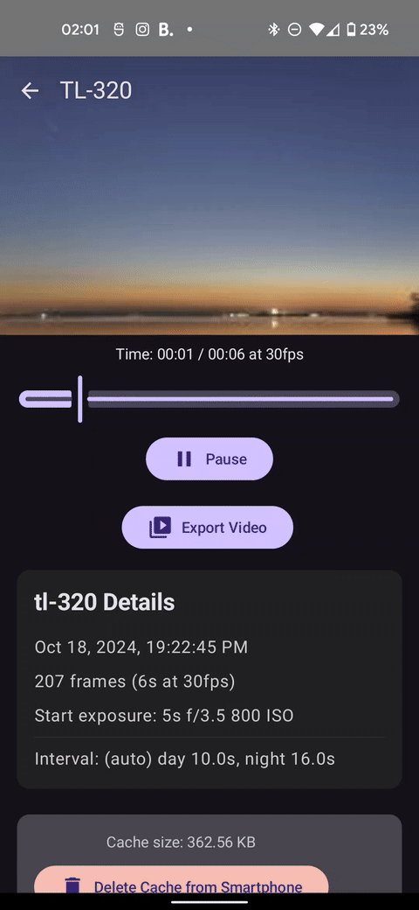

# ViewApp

ViewApp is an unofficial Android app for the Timelapse+ VIEW device. It requires a custom VIEW firmware available
here: [VIEW Releases](https://github.com/naixx/VIEW/releases/latest). Please install the latest version (1.8.54+).

The app works only in local networks, either with the VIEW hotspot or connected Wi-Fi. It does not connect to the remote app.view.tl host. The new
firmware still can connect to the remove host and works as before. Original app also works as before. 

## Motivation

During long day/night timelapses, I found the original app's connection to the device pretty unstable. In ViewApp, I've implemented a
persisted, self-restored connection. Even if the app is in the background, thumbnails will be saved for a currently running timelapse.

Another feature is that clips can be stored on a smartphone, making download times for them much faster. You can also export a clip video as
an MP4 file to share a preview.

## Installation

Download an apk from the [ViewApp Releases](https://github.com/naixx/viewapp/releases/latest) and install it on your phone.

## Development

If you want to build the app yourself, create a `secrets.properties` file in the root directory with your credentials (use
`secrets.properties.template` as a reference).

**Currently, timelapses can't be launched from the app in this version. This feature is in development.**
